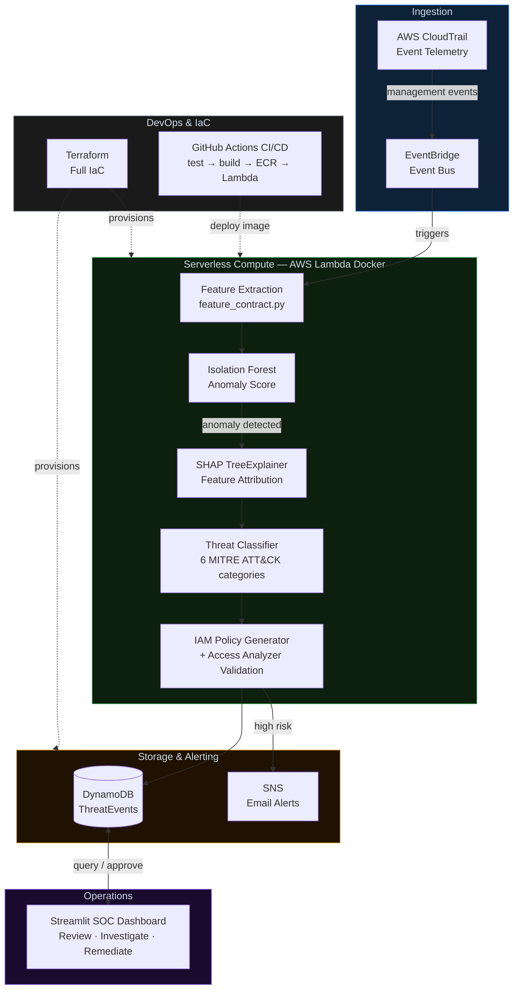

# CloudGuard

**AI-Powered AWS Cloud Security & MLOps Platform**

[](https://github.com/sani3055/CloudGuard/actions/workflows/ci.yml)
[](https://github.com/sani3055/CloudGuard/actions/workflows/ci.yml)
[](https://www.python.org/)
[](https://www.terraform.io/)
[](https://aws.amazon.com/)

---

CloudGuard is a production-grade, event-driven AWS security platform that ingests real-time CloudTrail telemetry, detects anomalies using an **Isolation Forest** ML model, and provides deep explainability via **SHAP (SHapley Additive exPlanations)**. When a threat is detected, the system automatically generates a least-privilege **IAM Deny policy**, validates it with **AWS Access Analyzer**, and stores it for one-click SOC approval.

---

## Architecture



---

## Key Features

### 🧠 Machine Learning
- **Isolation Forest** — unsupervised, no labeled data required; trained on 1.93M real CloudTrail events
- **Feature Contract** (`ml/feature_contract.py`) — single source of truth for feature extraction; used at both training and inference time
- **SHAP XAI** — every prediction includes `shap_values` for all 5 features, stored in DynamoDB alongside the event
- **Risk Score (0–100)** — normalized from raw IF decision score, weighted by severity and attribution confidence
- **6 MITRE ATT&CK categories** — Privilege Escalation, Defense Evasion, Credential Anomaly, Geographic Anomaly, Temporal Anomaly, Resource Exfiltration

### 🔒 Security Design
- **SIMULATION_MODE gate** (default `true`) — prevents any real IAM writes without explicit opt-in
- **ENFORCE_MODE gate** — second gate required before live enforcement
- **PROTECTED_PRINCIPALS** — comma-separated ARN list; these principals are never touched
- **Access Analyzer validation** — every generated IAM policy is validated for `ERROR` and `SECURITY_WARNING` findings before enforcement

### ⚙️ DevOps / IaC
- **Terraform** — ECR, Lambda, DynamoDB, CloudTrail, EventBridge, SNS, IAM OIDC roles — all reproducible
- **GitHub Actions OIDC** — keyless CI/CD; no long-lived AWS access keys
- **Docker Lambda** — bypasses 250MB layer limit; enables heavy ML libraries (`scikit-learn`, `shap`, `pandas`)

---

## Dashboard Pages

| Page | Description |
|---|---|
| **Overview** | Live risk score gauge, event volume chart, severity breakdown |
| **Event Investigation** | Per-event SHAP chart (real ML values from DB), IAM policy viewer, approve/reject remediation |
| **Analytics** | Trend analysis, regional heatmap, top API calls |
| **ML Intelligence** | Model hyperparameters, F1/Precision/Recall, feature importance |
| **Cloud Infrastructure** | Live boto3 diagnostics pinging Lambda, DynamoDB, ECR, EventBridge |
| **Architecture** | Full pipeline walkthrough |

> **LIVE vs DEMO:** When DynamoDB contains real events, the dashboard shows them. When empty, it falls back to 106 synthetic-but-pipeline-consistent events for demo purposes.

---

## Project Structure

```text
CloudGuard/
├── backend/
│   ├── Dockerfile                  # Lambda container image
│   ├── lambda_function.py          # Pipeline entry point
│   ├── config.py                   # All env-var defaults
│   ├── ml_inference.py             # IsolationForest inference
│   ├── xai_explainer.py            # SHAP TreeExplainer
│   ├── threat_classifier.py        # 6-category MITRE classifier
│   ├── iam_generator.py            # IAM Deny policy generation
│   ├── policy_validator.py         # AWS Access Analyzer validation
│   └── remediation.py             # DynamoDB write + IAM enforcement
├── ml/
│   ├── feature_contract.py         # SINGLE SOURCE OF TRUTH for features
│   ├── encoder.pkl                 # Fitted OrdinalEncoder
│   ├── model.pkl                   # Trained IsolationForest
│   └── retrain_real.py             # Retraining script
├── frontend/
│   ├── app.py                      # Streamlit navigation
│   ├── utils.py                    # load_data(), inject_css(), etc.
│   ├── pipeline_runner.py          # Local pipeline bridge for UI
│   └── pages/                      # 6 Streamlit pages
├── scripts/
│   └── seed_dynamodb.py            # Seeds DynamoDB with 106 real ML events
├── terraform/
│   ├── main.tf                     # ECR, DynamoDB, Lambda, SNS
│   ├── iam.tf                      # Lambda role + GitHub OIDC role
│   ├── cloudtrail.tf               # Optional CloudTrail + S3
│   ├── eventbridge.tf              # EventBridge rule + Lambda permission
│   └── variables.tf
├── tests/
│   ├── test_feature_contract.py    # Phase 0+1: encoder, model
│   ├── test_threat_classifier.py   # Phase 3: all 6 categories
│   ├── test_remediation_gates.py   # Phase 6: safety gates
│   └── test_full_validation.py     # End-to-end pipeline (no AWS)
└── .github/workflows/
    ├── ci.yml                      # Test + Build + Deploy (main branch)
    └── terraform.yml               # Terraform plan/apply
```

---

## Setup & Deployment

### Prerequisites
- Python 3.11+
- AWS CLI configured (`aws configure`)
- Terraform ≥ 1.5
- Docker (for Lambda image builds)

### 1. Local Dashboard

```bash
cd frontend
pip install -r requirements.txt
python -m streamlit run app.py
# Open http://localhost:8501
```

### 2. Run Test Suite

```bash
python -m pytest tests/ -v
# 126 passed
```

### 3. Seed DynamoDB with Real Events (optional)

```bash
python scripts/seed_dynamodb.py --dry-run   # validate first
python scripts/seed_dynamodb.py              # write 106 events to DynamoDB
```

### 4. AWS Deployment (Terraform)

```bash
cd terraform
terraform init
terraform plan
terraform apply
```

> **Note:** The Lambda resource requires a Docker image in ECR. Run the CI/CD workflow first (step 5), or push the image manually.

### 5. Enable CI/CD (GitHub Actions)

After `terraform apply`, add one secret to your GitHub repo:

| Secret | Value |
|---|---|
| `AWS_ROLE_TO_ASSUME` | `arn:aws:iam::648721530849:role/CloudGuard-GitHubActionsRole` |

**Settings → Secrets and variables → Actions → New repository secret**

From then on, every push to `main`:
1. Runs `pytest` (126 tests)
2. Builds the Docker image
3. Pushes to ECR
4. Updates the Lambda function

---

## Limitations & Future Work

- **Cold Starts:** Docker Lambda cold starts ~5–7s. Mitigate with Provisioned Concurrency in `lambda.tf`.
- **Model Drift:** The Isolation Forest is trained offline. Future: schedule retraining via SageMaker Pipelines or a GitHub Actions cron.
- **Step Functions:** Remediation state is tracked in DynamoDB strings. Future: multi-step remediation with AWS Step Functions.

---

**Author:** Sanidhya Bhandari  
**Stack:** Python · scikit-learn · SHAP · AWS Lambda · DynamoDB · ECR · EventBridge · Terraform · GitHub Actions · Streamlit
